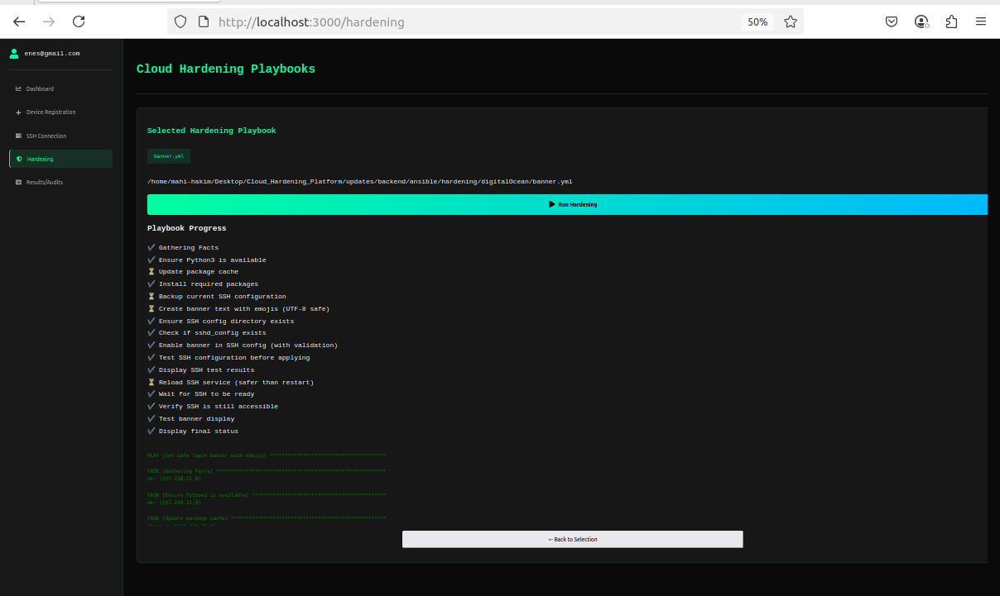

# Cloud Hardening Platform

An automated cloud server security platform that enhances server security on DigitalOcean through a simple web interface.

## 🎯 Overview

This platform allows system administrators to strengthen their cloud servers with one-click security operations, eliminating manual configuration complexity.

**Key Features:**
- SSH security hardening
- Firewall management  
- User access control
- Automated system updates
- Real-time operation feedback

## 🏗️ Architecture

- **Frontend**: React.js + Firebase Authentication
- **Backend**: Node.js + Express.js
- **Automation**: Ansible playbooks
- **Servers**: DigitalOcean VPS

## 📱 Screenshots

### Dashboard


### Hardening Operations


### SSH Connection Setup


## 🛠️ Tech Stack

| Layer | Technology |
|-------|------------|
| Frontend | React.js, Tailwind CSS |
| Backend | Node.js, Express.js |
| Authentication | Firebase |
| Automation | Ansible |
| Infrastructure | DigitalOcean VPS |

## 🚀 Quick Start

### Prerequisites
- Node.js (v16+)
- Ansible
- Firebase account
- SSH access to servers

### Installation

1. **Clone repository**
```bash
git clone https://github.com/yourusername/cloud-hardening-platform.git
cd cloud-hardening-platform
```

2. **Backend setup**
```bash
cd backend
npm install
```

Create `.env` file:
```env
FIREBASE_PROJECT_ID=your-project-id
FIREBASE_PRIVATE_KEY="your-private-key"
FIREBASE_CLIENT_EMAIL=your-service-email
PORT=5000
```

3. **Frontend setup**
```bash
cd frontend
npm install
```

Create `src/config/firebase.js`:
```javascript
const firebaseConfig = {
  apiKey: "your-api-key",
  authDomain: "your-domain",
  projectId: "your-project-id"
};
```

4. **Start application**
```bash
# Backend
cd backend && npm run dev

# Frontend  
cd frontend && npm start
```

## 💻 Usage

1. **Register/Login** - Create account and sign in
2. **Add Server** - Enter server IP and SSH details
3. **Select Operations** - Choose security hardening tasks
4. **Execute** - Click "Start Hardening" and monitor progress
5. **Review Results** - Check operation status and logs

## 🔧 Available Security Operations

- **SSH Hardening**: Disable root login, change ports
- **Firewall Setup**: Configure UFW rules
- **User Management**: Create secure users
- **System Updates**: Apply security patches
- **Login Banners**: Set security warnings

## 🛡️ Security Features

- Firebase authentication
- JWT token protection
- SSH key-based connections
- Encrypted communications
- Role-based access (User/Admin)

## 🚨 Troubleshooting

**Connection Issues:**
```bash
# Test SSH connection
ssh user@server-ip

# Test Ansible
ansible all -m ping
```

**Authentication Issues:**
- Check Firebase configuration
- Verify API keys
- Ensure Authentication is enabled

## 📄 License

MIT License - see [LICENSE](LICENSE) file.

